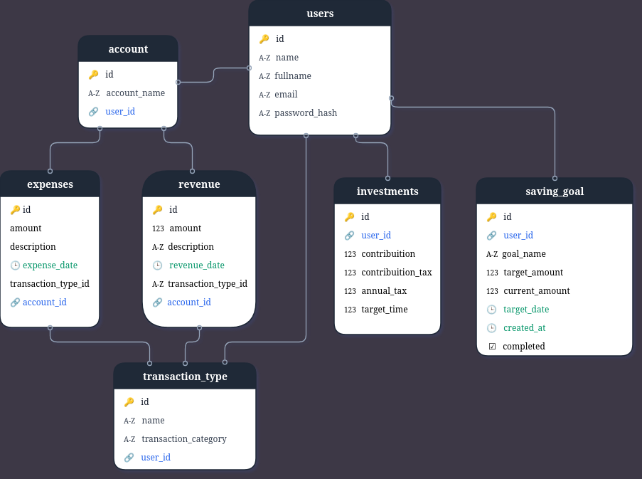
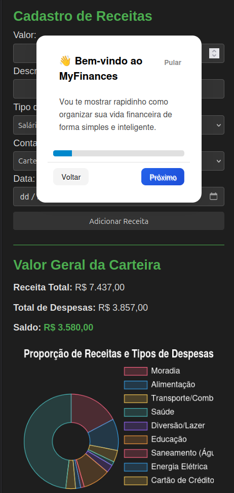
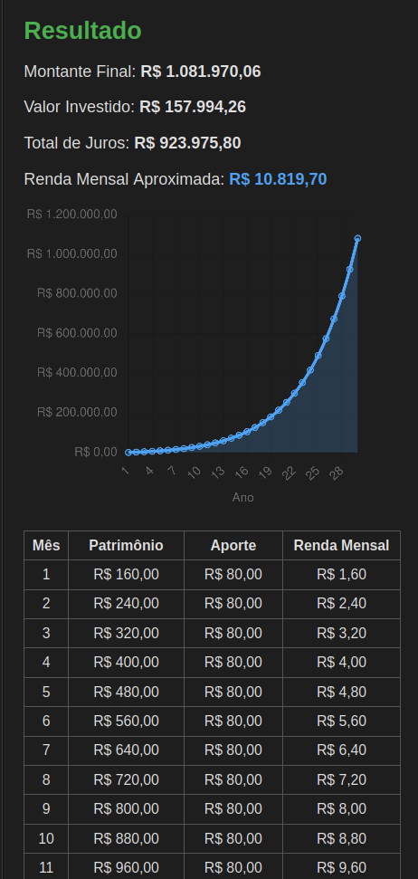

# 💰 Meu Financeiro


> Aplicativo web para **controle financeiro pessoal** com interface moderna, gráficos e suporte a múltiplas contas.

---

## 🚀 Funcionalidades

- ✅ Registro e login de usuários
- ✅ Gerenciamento de despesas, receitas e categorias
- ✅ Visualização de gráficos de receitas e despesas (Charts.js)
- ✅ Histórico detalhado de transações
- ✅ Simulador de Investimentos e cadastramentos de metas
- ✅ Modo escuro
- ✅ Calendário financeiro

---

## 🛠 Tecnologias

| Backend     | Frontend      | Banco de Dados | Outros                      |
|-------------|---------------|----------------|-----------------------------|
| Python 3.12 | HTML, CSS, JS | PostgreSQL     | Flask, Bootstrap, Charts.js |

---

## 🖼 Banco de Dados



---

## 🖼 Demonstração





---

## 📂 Estrutura do Projeto

```
Meu_Financeiro/
├─ app/
│ ├─ static/ 
│ ├─ templates/ 
│ ├─ config.py 
│ ├─ models.py 
│ ├─ routes.py 
│ └─ utils.py
├─ instances/
│ └─ users.sql
├─ migrations/ 
├─ create_tables
├─ run.py 
├─ requirements
└─ README.md 
```

---

## ⚖ Licença

MIT License © Carolalx
